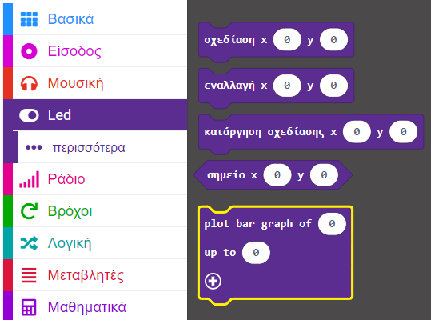

Μπορείς να σχεδιάσεις ένα ραβδόγραμμα στα LED για να εμφανίσεις τιμές από τους αισθητήρες.

### Σχεδίασε ραβδόγραμμα

Σε αυτό το παράδειγμα, οι τιμές του επιταχυνσιόμετρου απεικονίζονται ως ραβδόγραμμα.

Μπορείς να βρεις το μπλοκ `plot bar graph`{:class='microbitled'} στο μενού `Led`{:class='microbitled'}.



Τοποθέτησε το μπλοκ `plot bar graph`{:class='microbitled'} μέσα σε ένα μπλοκ συμβάντος ή σε ένα μπλοκ βρόχου. Το μπλοκ `every`{:class='microbitloops'} έχει χρησιμοποιηθεί σε αυτό το παράδειγμα.

```microbit
loops.everyInterval(500, function () {
    led.plotBarGraph(
    0,
    0
    )
})
```

Από το μενού `Είσοδος`{:class='microbitinput'}, πάρε το μπλοκ `επιτάχυνση`{:class='microbitinput'}.

Τοποθέτησε το μπλοκ `επιτάχυνση`{:class='microbitinput'} μέσα στο πρώτο `0` στο μπλοκ `plot bar graph`{:class='microbitled'}.

```microbit
loops.everyInterval(500, function () {
    led.plotBarGraph(
    input.acceleration(Dimension.X),
    0
    )
})
```

Θα χρειαστεί να προσθέσεις τη μέγιστη τιμή που θα αποτυπωθεί στο γράφημα. Αντικατέστησε το δεύτερο «0» στο μπλοκ `plot bar graph`{:class='microbitled'} με τη μέγιστη τιμή σου.

Σε αυτό το παράδειγμα, έχει χρησιμοποιηθεί το 1023, το οποίο είναι η μέγιστη τιμή της επιτάχυνσης σε mg που μπορεί να ανιχνευτεί από το επιταχυνσιόμετρο. Η μέγιστη τιμή θα είναι διαφορετική για άλλους αισθητήρες.

```microbit
loops.everyInterval(500, function () {
    led.plotBarGraph(
    input.acceleration(Dimension.X),
    1023
    )
})
```

Τα LED στο micro:bit θα ανάψουν για να δείξουν την τιμή του αισθητήρα που καταγράφεται μέχρι το πεδίο μέγιστης τιμής.


