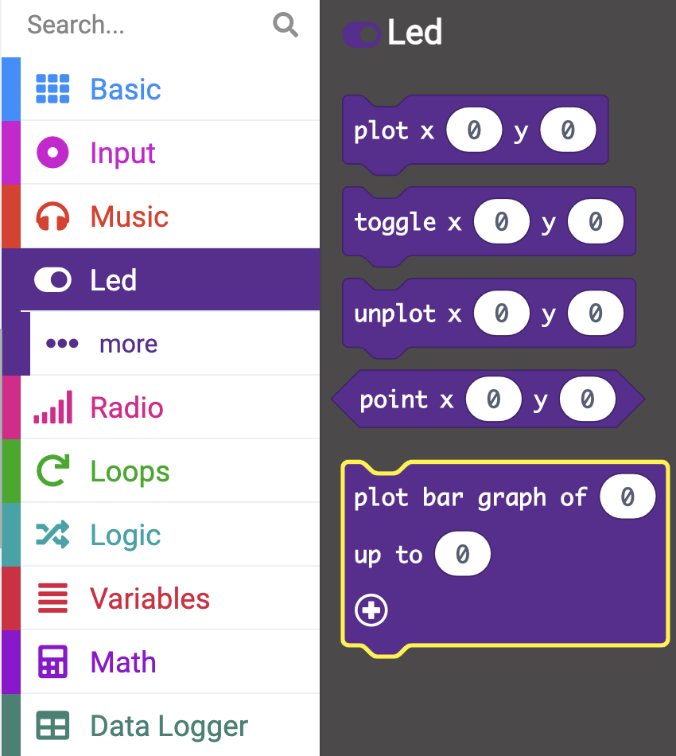

You can plot a bar graph to display data from the sensors on the LEDs.

### Plot bar graph

In this example, the accelerometer has been used as the sensor for plotting your bar graph.

From inside the `Led`{:class='microbitled'} menu, you can find the `plot bar graph`{:class='microbitled'} block.



Place the `plot bar graph`{:class='microbitled'} block inside an event block or a loop block. The `every`{:class='microbitloops'} block has been used in this example.

```microbit
loops.everyInterval(500, function () {
    led.plotBarGraph(
    0,
    0
    )
})
```

From the `Input`{:class='microbitinput'} menu, you can find a sensor or input to measure with your graph. 

The `acceleration`{:class='microbitinput'} block has been used in this example.

Place the `acceleration`{:class='microbitinput'} block inside the `0` to the left of the `plot bar graph`{:class='microbitled'} block.

```microbit
loops.everyInterval(500, function () {
    led.plotBarGraph(
    input.acceleration(Dimension.X),
    0
    )
})
```

Inside the `0` to the right of the `plot bar graph`{:class='microbitled'} block, you will need to write the maximum value to be recorded to the graph.

In this example, 1023 mg has been used. This value will be different for other sensors.

```microbit
loops.everyInterval(500, function () {
    led.plotBarGraph(
    input.acceleration(Dimension.X),
    1023
    )
})
```

The LEDs on the micro:bit will light up to show the value of the sensor being recorded against the maximum value field.


