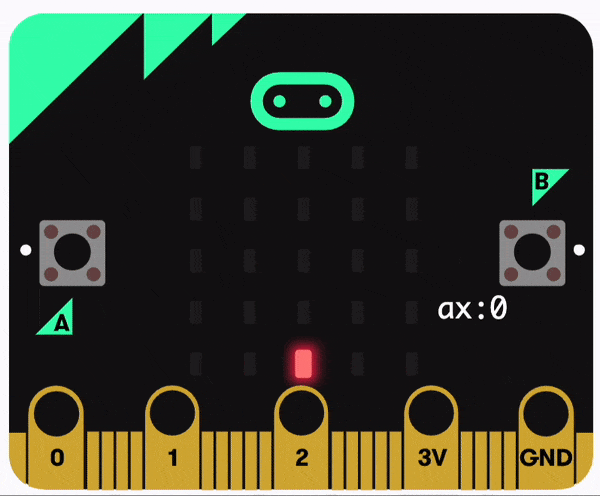

You can plot a bar graph to record data in the real world using the micro:bit. 

On the V2, you can use inputs and sensors or on the V1, the input can measure data.

### Plot bar graph for V2 users

In this example, the accelerometer has been used as the sensor for plotting your bar graph.

From inside the `Led`{:class='microbitled'} menu, you can find the `plot bar graph`{:class='microbitled'} block.


Place the `plot bar graph`{:class='microbitled'} block inside an event block or a loop block. The `every`{:class='microbitloops'} block has been used in this example.

```microbit
loops.everyInterval(500, function () {
    led.plotBarGraph(
    0,
    0
    )
})
```

From the `Input`{:class='microbitinput'} menu, you can find a sensor or input to measure with your graph. 

The `acceleration`{:class='microbitinput'} block has been used in this example.

Place the `acceleration`{:class='microbitinput'} block inside the `0` to the left of the `plot bar graph`{:class='microbitled'} block.

```microbit
loops.everyInterval(500, function () {
    led.plotBarGraph(
    input.acceleration(Dimension.X),
    0
    )
})
```

Inside the `0` to the right of the `plot bar graph`{:class='microbitled'} block, you will need to write the maximum value to be recorded to the graph.

In this example, 1023 mg has been used. This value will be different for other sensors.

```microbit
loops.everyInterval(500, function () {
    led.plotBarGraph(
    input.acceleration(Dimension.X),
    1023
    )
})
```

The LEDs on the micro:bit will light up to show the value of the sensor being recorded against the maximum value field.



To view the graph being plotted, click on the Advanced tab at the bottom of your Toolbox.

This will expand to show more menu options.

Click on the Serial menu to find the `serial write line` block.

Place it below the `plot bar graph`{:class='microbitled'} block.

```microbit
loops.everyInterval(500, function () {
    led.plotBarGraph(
    input.acceleration(Dimension.X),
    1023
    )
    serial.writeLine("")
})
```

From the `Input`{:class='microbitinput'} menu, find the `acceleration`{:class='microbitinput'} block.

Place it inside the empty field on the `serial write line` block.

```microbit
loops.everyInterval(500, function () {
    led.plotBarGraph(
    input.acceleration(Dimension.X),
    1023
    )
    serial.writeLine("" + (input.acceleration(Dimension.X)))
})
```

You can connect your micro:bit to your computer to view your graph.

You can also view the graph by clicking `show data` on the simulator.

### Plot bar graph for V1 users
