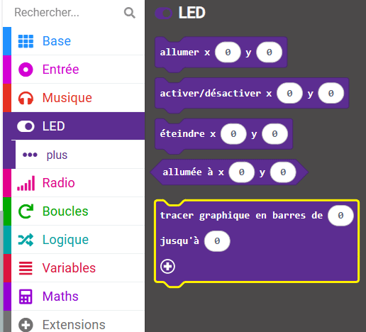
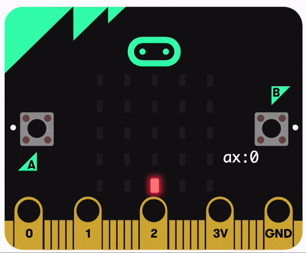

Tu peux tracer un graphique à barres sur les LED pour afficher les valeurs des capteurs.

### Tracer un graphique à barres

Dans cet exemple, les valeurs de l'accéléromètre sont tracées sous la forme d'un graphique à barres.

Tu peux trouver le bloc `tracer graphique en barres`{:class='microbitled'} dans le menu `LED`{:class='microbitled'}.



Place le bloc `tracer graphique en barres`{:class='microbitled'} à l'intérieur d'un bloc événement ou d'un bloc boucle. Le bloc `chaque`{:class='microbitloops'} a été utilisé dans cet exemple.

```microbit
loops.everyInterval(500, function () {
    led.plotBarGraph(
    0,
    0
    )
})
```

Dans le menu `Entrée`{:class='microbitinput'}, prends le bloc `accélération`{:class='microbitinput'}.

Place le bloc `accélération`{:class='microbitinput'} à l'intérieur du premier `0` dans le bloc `tracer graphique en barres`{:class='microbitled'}.

```microbit
loops.everyInterval(500, function () {
    led.plotBarGraph(
    input.acceleration(Dimension.X),
    0
    )
})
```

Tu devras ajouter la valeur maximale à tracer sur le graphique. Remplace le deuxième `0` dans le bloc `tracer graphique en barres`{:class='microbitled'} avec ta valeur maximale.

Dans cet exemple, 1023 a été utilisé, ce qui correspond à la valeur maximale d'accélération en mg pouvant être détectée par l'accéléromètre. La valeur maximale sera différente pour les autres capteurs.

```microbit
loops.everyInterval(500, function () {
    led.plotBarGraph(
    input.acceleration(Dimension.X),
    1023
    )
})
```

Les LED sur le micro:bit s'allumeront pour montrer la valeur du capteur enregistré jusqu'à la valeur maximale.


