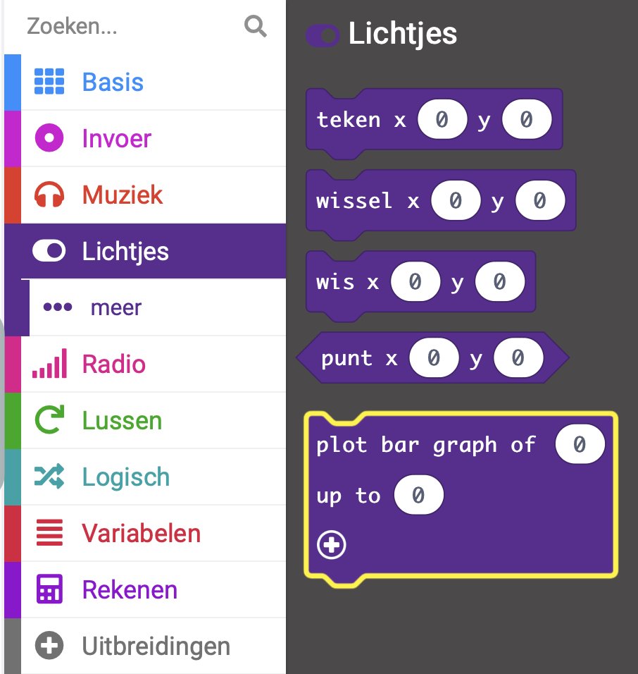
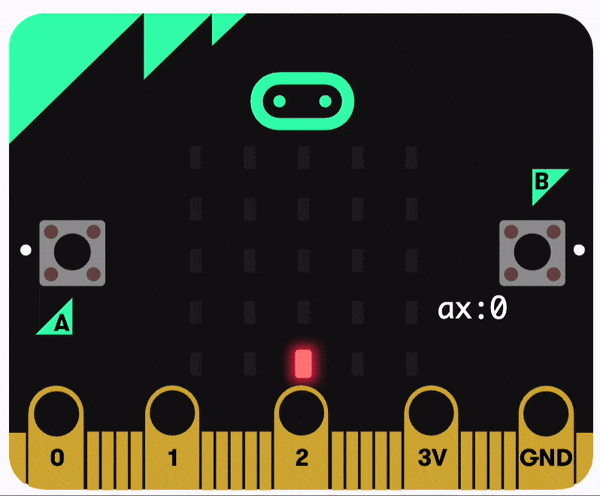

Je kunt een staafdiagram tekenen met de lichtjes om waarden van de sensoren weer te geven.

### Teken een staafdiagram

In dit voorbeeld worden de waarden van de versnellingsmeter weergegeven in een staafdiagram.

Je kunt het blok `plot bar graph`{:class='microbitled'} vinden in het menu `Lichtjes`{:class='microbitled'}.



Plaats het blok `plot bar graph`{:class='microbitled'} in een gebeurtenisblok of een lusblok. Het `elk (ms)`{:class='microbitloops'} blok is in dit voorbeeld gebruikt.

```microbit
loops.everyInterval(500, function () {
    led.plotBarGraph(
    0,
    0
    )
})
```

Haal vanuit het menu `Invoer`{:class='microbitinput'} het blok `versnelling (mg)`{:class='microbitinput'} op.

Plaats het `versnelling (mg)`{:class='microbitinput'} blok binnen de eerste `0` in het `plot bar graph`{:class='microbitled'} blok.

```microbit
loops.everyInterval(500, function () {
    led.plotBarGraph(
    input.acceleration(Dimension.X),
    0
    )
})
```

Je moet de maximale waarde die in de grafiek getekend kan worden toevoegen. Vervang de tweede `0` in het `plot bar graph`{:class='microbitled'} blok door je maximale waarde.

In dit voorbeeld is 1023 gebruikt, wat de maximale versnellingswaarde in mg is die door de versnellingsmeter kan worden waargenomen. Voor andere sensoren zal de maximale waarde anders zijn.

```microbit
loops.everyInterval(500, function () {
    led.plotBarGraph(
    input.acceleration(Dimension.X),
    1023
    )
})
```

De LED's op de micro:bit gaan branden om de waarde van de sensor die wordt geregistreerd weer te geven tot aan het maximale waardeveld.


